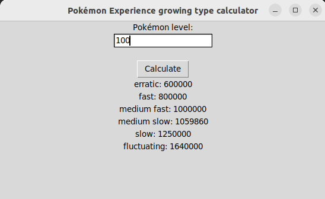

# Pokémon Growth Experience Calculator

This program is made using [Python](https://www.python.org/).
Have you ever wondered about the growth experience of your Pokémon?
This program helps you determine the type of growth experience a Pokémon has, 
which can be particularly useful in games where experience points are limited 
by the number of battles against trainers on your route.

## Table of Contents
- [About](#about)
- [Versions](#versions)
- [Resources](#resources)
- [Contributing](#contributing)
- [License](#license)

## About
The Pokémon Growth Experience Calculator is a tool that assists you in 
understanding the growth experience of your Pokémon. It provides insights 
into how your Pokémon's experience points are distributed and helps you make 
strategic decisions in training them.

## Versions
There are two versions of the program available:

### Console Version
- The console is going to ask you to input a Pokemon level number and depending 
of the amount of experience your Pokemon has his growth type is one or the other.

### Graphic Version with Tkinter
- In this case you have to input the Pokemon level number inside de textbox
under the Pokemon level tag. Then you have to press the calculate button
and the results are going to be displayed under.

## Resources
To learn more about Pokémon experience growth, you can refer to [Bulbapedia's page on Experience](https://bulbapedia.bulbagarden.net/wiki/Experience).

## Contributing

Contributions are welcome! If you'd like to contribute to Pokémon Growth Experience Calculator, please follow these steps:

1. Fork this repository.
2. Create a new branch: `git checkout -b feature/your-feature-name`.
3. Make your changes and commit them: `git commit -am 'Add new feature'`.
4. Push to the branch: `git push origin feature/your-feature-name`.
5. Create a pull request.

## License
This project is licensed under the GNU General Public License v3.0. See the [LICENSE](LICENSE) file for details.